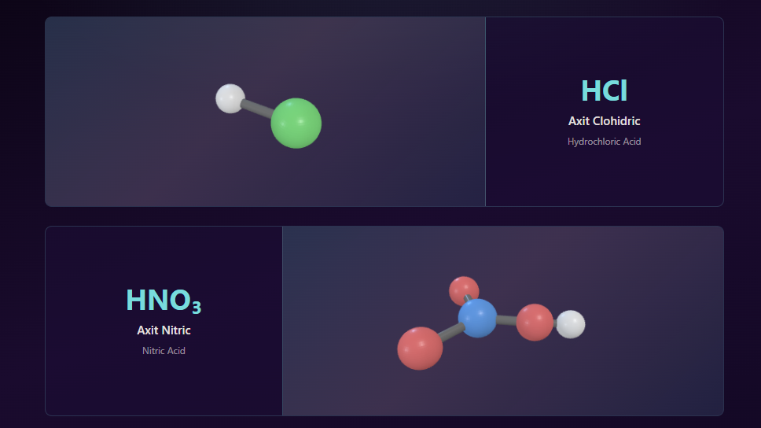

# Bài tập lớn Đồ họa máy tính

- Tích hợp các sản phẩm đồ họa để hỗ trợ giảng dạy chương trình Khoa học tự nhiên lớp 8.
- Chủ đề: Chương II: Một số hợp chất thông dụng.

## 1) Công nghệ sử dụng

- **Blender**: dựng mô hình phân tử 3D (ball-and-stick), xuất định dạng **glTF/GLB**
- **Three.js**: hiển thị mô hình 3D trên web, cho phép **xoay/zoom** (OrbitControls), ánh sáng/camera
- **React + TypeScript (TSX)**: xây dựng giao diện và cấu trúc trang
- **React Router**: điều hướng giữa các trang (Home → Chương)
- **Tailwind CSS**: styling theo theme
- **Vite**: dev server + build

## 2) Cách tải và chạy trên máy cá nhân

### Yêu cầu

- **Node.js** (khuyến nghị Node 18+)

### Chạy dự án

Chạy các lệnh trong terminal.

```bash
cd threejs
npm install
npm run dev
```

Sau đó mở trình duyệt theo URL Vite in ra.

### Ghi chú về mô hình 3D

- Các file mô hình đang được phục vụ dưới dạng static ở `threejs/public/models/`:
  - `threejs/public/models/HCl.glb`
  - `threejs/public/models/HNO3.glb`
  - `threejs/public/models/H2SO4.glb`
- Khi cần chỉnh mô hình: dựng trong **Blender** và export lại `.glb` vào đúng thư mục trên.

## 3) Hình ảnh demo



## Hướng phát triển (đồ họa)

- **Tối ưu trải nghiệm 3D**: light rig đẹp hơn, auto-fit camera chuẩn hơn, hiệu ứng nền nhẹ (không chói)
- **Tương tác học liệu**: bật/tắt nhãn nguyên tử, highlight liên kết, mô phỏng phản ứng/hiện tượng, câu hỏi trắc nghiệm
- **Chuẩn hóa asset**: thống nhất tỉ lệ/độ chi tiết mô hình, export pipeline Blender → GLB, quản lý thư viện mô hình

